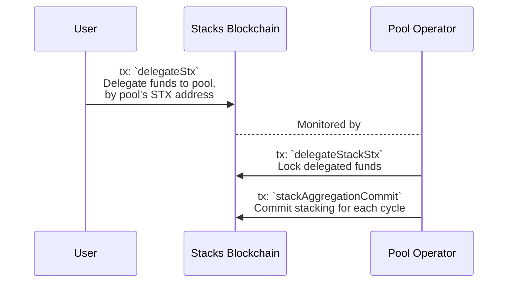

# @stacks/stacking [](https://www.npmjs.com/package/@stacks/stacking) <!-- omit in toc -->

Library for PoX Stacking.

## Installation <!-- omit in toc -->

```shell
npm install @stacks/stacking
```

- [Initialization](#initialization)
- [Signing](#signing)
  - [Topics](#topics)
- [Stack STX](#stack-stx)
  - [Check stacking eligibility](#check-stacking-eligibility)
  - [Build and broadcast a solo-stacking transaction](#build-and-broadcast-a-solo-stacking-transaction)
  - [Extend stacking](#extend-stacking)
  - [Increase amount stacked](#increase-amount-stacked)
- [Client helpers](#client-helpers)
  - [Will Stacking be executed in the next cycle?](#will-stacking-be-executed-in-the-next-cycle)
  - [How long (in seconds) is a Stacking cycle?](#how-long-in-seconds-is-a-stacking-cycle)
  - [How much estimated time is left (in seconds) to submit a stacking transaction for the upcoming reward cycle?](#how-much-estimated-time-is-left-in-seconds-to-submit-a-stacking-transaction-for-the-upcoming-reward-cycle)
  - [Does account have sufficient STX to meet minimum threshold?](#does-account-have-sufficient-stx-to-meet-minimum-threshold)
  - [Get PoX info](#get-pox-info)
  - [Get Stacks node info](#get-stacks-node-info)
  - [Get account balance](#get-account-balance)
  - [Get account balance locked](#get-account-balance-locked)
  - [Get account balances (from API)](#get-account-balances-from-api)
  - [Get account stacking status](#get-account-stacking-status)
  - [Get PoX operation info (current period and PoX contract versions)](#get-pox-operation-info-current-period-and-pox-contract-versions)
- [Delegated stacking](#delegated-stacking)
  - [Stacking in a pool](#stacking-in-a-pool)
    - [Delegate STX](#delegate-stx)
    - [Revoke delegation](#revoke-delegation)
  - [Operating a pool / Stacking for others](#operating-a-pool--stacking-for-others)
    - [Stack delegated STX](#stack-delegated-stx)
    - [Extend delegated STX](#extend-delegated-stx)
    - [Increase delegated STX](#increase-delegated-stx)
    - [Commit to stacking](#commit-to-stacking)
    - [Increase existing commitment](#increase-existing-commitment)
    - [Pool helpers](#pool-helpers)
      - [Get burnchain rewards](#get-burnchain-rewards)
      - [Get burnchain rewards total](#get-burnchain-rewards-total)
      - [Get burnchain reward holders](#get-burnchain-reward-holders)
      - [Get reward set by index](#get-reward-set-by-index)

## Initialization

Initialize a `StackingClient` to interact with the Stacking contract.

> **Note:** The `StackingClient` sets its transactions `AnchorMode` to `Any` by default.

```typescript
import { StacksTestnet, StacksMainnet } from '@stacks/network';
import { StackingClient } from '@stacks/stacking';

// for mainnet: const network = new StacksMainnet();
const network = new StacksTestnet();
// the stacks STX address
const address = 'ST3XKKN4RPV69NN1PHFDNX3TYKXT7XPC4N8KC1ARH';
const client = new StackingClient(address, network);
```

## Signing

_Coming with epoch 2.5 and Nakamoto_, stackers are required to include signer signatures for their stacking transactions.
[Signers](https://docs.stacks.co/nakamoto-upgrade/signing-and-stacking/running-a-signer) need to be run along side Stacks nodes to participate in the [PoX consensus](https://docs.stacks.co/nakamoto-upgrade/nakamoto-in-depth/stackers-and-signing).

The `StackingClient` provides a helper method to create a signer signature for a stacking transaction.

```typescript
// the id of the current cycle
const currentCycle = 83;
// a BTC address for reward payouts
const poxAddress = 'mvuYDknzDtPgGqm2GnbAbmGMLwiyW3AwFP';
// number cycles to stack
const cycles = 3;
// how much to stack (at most), in microSTX
const maxAmount = 100000000000n;
// the auth id of the signer (a random id to not allow reusing the signature)
const authId = 702;

const signerPrivateKey = makeRandomPrivKey(); // replace with your signer private key

const signature = client.signPoxSignature({
  topic: 'stack-stx', // the topic of the transaction
  poxAddress,
  rewardCycle: currentCycle,
  period: cycles,
  maxAmount,
  authId,
  signerPrivateKey,
});
```

> [!WARNING]
> Make sure to replace `signerPrivateKey` with the signer private key of your setup and keep it private.

### Topics

Signatures include a topic, so they can only be used for the intended transaction type. The following topics are available:

- `stack-stx`
- `stack-extend`
- `stack-increase`
- `agg-commit`
- `agg-increase`

## Stack STX

### Check stacking eligibility

```typescript
// a BTC address for reward payouts
const poxAddress = 'mvuYDknzDtPgGqm2GnbAbmGMLwiyW3AwFP';
// number cycles to stack
const cycles = 3;

// Refer to initialization section to create client instance
const stackingEligibility = await client.canStack({ poxAddress, cycles });

// {
//   eligible: false,
//   reason: 'ERR_STACKING_INVALID_LOCK_PERIOD',
// }
```

### Build and broadcast a solo-stacking transaction

> [!NOTE]
> For the cycles given, the signer-key cannot be changed.

```typescript
// a BTC address for reward payouts
const poxAddress = 'mvuYDknzDtPgGqm2GnbAbmGMLwiyW3AwFP';
// number cycles to stack
const cycles = 3;
// how much to stack, in microSTX
const amountMicroStx = 100000000000n;
// private key for transaction signing
const privateKey = 'd48f215481c16cbe6426f8e557df9b78895661971d71735126545abddcd5377001';
// block height at which to stack
const burnBlockHeight = 2000;
// signature `maxAmount`
const maxAmountMicroStx = amountMicroStx;
// signature `authId` (random id)
const authId = 3;

// signer key
const signerPrivateKey = makeRandomPrivKey();
const signerKey = getPublicKeyFromPrivate(signerPrivateKey.data);

// Refer to initialization section to create client instance

// Generate the signer signature
const signerSignature = client.signPoxSignature({
  topic: 'stack-stx',
  rewardCycle: await client.getPoxInfo().reward_cycle_id,
  poxAddress,
  period: cycles,
  maxAmount,
  authId,

  signerPrivateKey,
});

// Build and broadcast the stacking transaction
const stackingResult = await client.stack({
  amountMicroStx,
  poxAddress,
  cycles,
  burnBlockHeight,

  signerKey,
  signerSignature,
  maxAmountMicroStx,
  authId,

  privateKey,
});

// {
//   txid: '0xf6e9dbf6a26c1b73a14738606cb2232375d1b440246e6bbc14a45b3a66618481',
// }
```

### Extend stacking

Extends previously stacked funds without cooldown.

```typescript
// number cycles to extend stacking by
const extendCycles = 3;
// a BTC address for reward payouts
const poxAddress = 'mvuYDknzDtPgGqm2GnbAbmGMLwiyW3AwFP';
// private key for transaction signing
const privateKey = 'd48f215481c16cbe6426f8e557df9b78895661971d71735126545abddcd5377001';
// signature `maxAMount`
const maxAmountMicroStx = 100000000000n;
// signature `authId` (random id)
const authId = 4;

// signer key
const signerPrivateKey = makeRandomPrivKey();
const signerKey = getPublicKeyFromPrivate(signerPrivateKey.data);

// Refer to initialization section to create client instance
// Generate the signer signature
const signerSignature = client.signPoxSignature({
  topic: 'stack-extend',
  poxAddress,
  period: extendCycles,
  maxAmount,
  authId,

  signerPrivateKey,
});

// Build and broadcast the stacking transaction
const extendResult = await client.stackExtend({
  extendCycles,
  poxAddress,

  signerKey,
  signerSignature,
  maxAmount,
  authId,

  privateKey,
});

// {
// txid: '0xf6e9dbf6a26c1b73a14738606cb2232375d1b440246e6bbc14a45b3a66618481',
// }
```

### Increase amount stacked

Increases the amount of funds stacked/locked after previously stacking.

```typescript
// how much to increase by, in microSTX
const increaseBy = 3000000;
// private key for transaction signing
const privateKey = 'd48f215481c16cbe6426f8e557df9b78895661971d71735126545abddcd5377001';
// signature `maxAmount`
const maxAmount = increaseBy;
// signature `authId` (random id)
const authId = 5;

// signer key
const signerPrivateKey = makeRandomPrivKey();
const signerKey = getPublicKeyFromPrivate(signerPrivateKey.data);

// Refer to initialization section to create client instance
// Generate the signer signature
const signerSignature = client.signPoxSignature({
  topic: 'stack-increase',
  poxAddress,
  period: extendCycles,
  maxAmount,
  authId,

  signerPrivateKey,
});

// Build and broadcast the stacking transaction
const increaseResults = await client.stackIncrease({
  increaseBy,

  signerKey,
  signerSignature,
  maxAmount,
  authId,

  privateKey,
});

// {
//   txid: '0xf6e9dbf6a26c1b73a14738606cb2232375d1b440246e6bbc14a45b3a66618481',
// }
```

## Client helpers

### Will Stacking be executed in the next cycle?

```typescript
const stackingEnabledNextCycle = await client.isStackingEnabledNextCycle();

// true / false
```

### How long (in seconds) is a Stacking cycle?

```typescript
const cycleDuration = await client.getCycleDuration();

// 120
```

### How much estimated time is left (in seconds) to submit a stacking transaction for the upcoming reward cycle?

```typescript
const seconds = await client.getSecondsUntilStackingDeadline();

// 600000
```

### Does account have sufficient STX to meet minimum threshold?

```typescript
const hasMinStxAmount = await client.hasMinimumStx();

// true / false
```

### Get PoX info

```typescript
const poxInfo = await client.getPoxInfo();

// {
//   contract_id: 'ST000000000000000000002AMW42H.pox',
//   first_burnchain_block_height: 0,
//   min_amount_ustx: 83335083333333,
//   prepare_cycle_length: 30,
//   rejection_fraction: 3333333333333333,
//   reward_cycle_id: 17,
//   reward_cycle_length: 120,
//   rejection_votes_left_required: 0,
//   total_liquid_supply_ustx: 40000840000000000
// }
```

### Get Stacks node info

```typescript
const coreInfo = await client.getCoreInfo();

// {
//   peer_version: 385875968,
//   pox_consensus: 'bb88a6e6e65fa7c974d3f6e91a941d05cc3dff8e',
//   burn_block_height: 2133,
//   stable_pox_consensus: '2284451c3e623237def1f8caed1c11fa46b6f0cc',
//   stable_burn_block_height: 2132,
//   server_version: 'blockstack-core 0.0.1 => 23.0.0.0 (HEAD:a4deb7a+, release build, linux [x86_64])',
//   network_id: 2147483648,
//   parent_network_id: 3669344250,
//   stacks_tip_height: 1797,
//   stacks_tip: '016df36c6a154cb6114c469a28cc0ce8b415a7af0527f13f15e66e27aa480f94',
//   stacks_tip_consensus_hash: 'bb88a6e6e65fa7c974d3f6e91a941d05cc3dff8e',
//   unanchored_tip: '6b93d2c62fc07cf44302d4928211944d2debf476e5c71fb725fb298a037323cc',
//   exit_at_block_height: null
// }
```

### Get account balance

```typescript
const responseBalanceInfo = await client.getAccountBalance();

// 800000000000
```

### Get account balance locked

```typescript
const responseBalanceLockedInfo = await client.getAccountBalanceLocked();

// 40000000000
```

### Get account balances (from API)

```typescript
const responseBalancesInfo = await client.getAccountExtendedBalances();

// {
//   stx: {
//     balance: '1000000',
//     total_sent: '0',
//     total_received: '1000000',
//     lock_tx_id: '0xec94e7d20af8979b44d17a0520c126bf742b999a0fc7ddbcbe0ab21b228ecc8c',
//     locked: '50000',
//     lock_height: 100,
//     burnchain_lock_height: 100,
//     burnchain_unlock_height: 200,
//   },
//   fungible_tokens: {},
//   non_fungible_tokens: {},
// }
```

### Get account stacking status

```typescript
const stackingStatus = await client.getStatus();

// {
//   stacked: true,
//   details: {
//     first_reward_cycle: 18,
//     lock_period: 10,
//     unlock_height: 3020,
//     pox_address: {
//       version: '00',
//       hashbytes: '05cf52a44bf3e6829b4f8c221cc675355bf83b7d'
//     }
//   }
// }
```

### Get PoX operation info (current period and PoX contract versions)

```typescript
const poxOperationInfo = await client.getPoxOperationInfo();

// {
//   period: 'Period3',
//   pox1: {
//     contract_id: 'ST000000000000000000002AMW42H.pox',
//     activation_burnchain_block_height: 0,
//     first_reward_cycle_id: 0,
//   },
//   pox2: {
//     contract_id: 'ST000000000000000000002AMW42H.pox-2',
//     activation_burnchain_block_height: 120,
//     first_reward_cycle_id: 25,
//   },
// }
```

## Delegated stacking

These are the methods for creating the required transactions for delegated stacking:

- [Stacking in a pool](#stacking-in-a-pool)
  - [`.delegateStx` Delegate STX](#delegate-stx)
  - [`.revokeDelegateStx` Revoke delegation](#revoke-delegation)
- [Operating a pool](#operating-a-pool)
  - [`.delegateStackStx` Stack delegated STX](#stack-delegated-stx)
  - [`.stackAggregationCommitIndexed` Commit to stacking](#commit-to-stacking)



### Stacking in a pool

If you are the account owner ("stacker"), you can delegate or revoke delegation rights.

#### Delegate STX

```typescript
// STX address of the pool/pool
const delegateTo = 'ST2MCYPWTFMD2MGR5YY695EJG0G1R4J2BTJPRGM7H';
// burn height at which the delegation relationship should be revoked (optional)
const untilBurnBlockHeight = 5000;
// how much to stack, in microSTX
const amountMicroStx = 100000000000n;
// private key for transaction signing
const privateKey = 'd48f215481c16cbe6426f8e557df9b78895661971d71735126545abddcd5377001';

const delegetateResponse = await client.delegateStx({
  amountMicroStx,
  delegateTo,
  untilBurnBlockHeight, // optional
  privateKey,
});

// {
//   txid: '0xf6e9dbf6a26c1b73a14738606cb2232375d1b440246e6bbc14a45b3a66618481',
// }
```

#### Revoke delegation

```typescript
// private key for transaction signing
const privateKey = 'd48f215481c16cbe6426f8e557df9b78895661971d71735126545abddcd5377001';

const revokeResponse = await client.revokeDelegateStx(privateKey);

// {
//   txid: '0xf6e9dbf6a26c1b73a14738606cb2232375d1b440246e6bbc14a45b3a66618481',
// }
```

### Operating a pool / Stacking for others

If you are a pool operator (or wish to stack with someone else's funds), you can stack ("lock up") tokens for your users and commit to stacking participation for upcoming reward cycles.
These users need to first "delegate" some or all of their funds to you (the "pool").
The following examples refer to the "delegate" as pool, but in practice a delegator can also stack for only single or few individuals.
Even a group of friends could stack together and share a multi-sig BTC wallet for payouts.

#### Stack delegated STX

Stack STX, which have been previously delegated to the pool.
This step only locks the funds (partial stacking) and doesn't require a signer-key/signature yet.
The pool operator will also need to ["commit"](#commit-to-stacking) to a reward cycle.

```typescript
import { getNonce } from '@stacks/transactions';
import { StacksTestnet, StacksMainnet } from '@stacks/network';
import { StackingClient } from '@stacks/stacking';

// for mainnet: const network = new StacksMainnet();
const network = new StacksTestnet();
// the stacks STX address
const address = 'ST3XKKN4RPV69NN1PHFDNX3TYKXT7XPC4N8KC1ARH';
// pools would initiate a different client
const poolAddress = 'ST22X605P0QX2BJC3NXEENXDPFCNJPHE02DTX5V74';
// pool private key for transaction signing
const poolPrivateKey = 'd48f215481c16cbe6426f8e557df9b78895661971d71735126545abddcd5377001';
// the BTC address for reward payouts
const poolBtcAddress = 'msiYwJCvXEzjgq6hDwD9ueBka6MTfN962Z';
// how much to stack, in microSTX
const amountMicroStx = 100000000000n;
// block height at which to stack
const burnBlockHeight = 2000;
// number cycles to stack
const cycles = 3;
// if you call this method multiple times in the same block, you need to increase the nonce manually
const nonce = await getNonce(poolAddress, network);

const poolClient = new StackingClient(poolAddress, network);

const delegetateStackResponses = await poolClient.delegateStackStx({
  stacker: address,
  amountMicroStx,
  poxAddress: poolBtcAddress,
  burnBlockHeight,
  cycles,
  privateKey: poolPrivateKey,
  nonce, // optional
});

// {
//   txid: '0xf6e9dbf6a26c1b73a14738606cb2232375d1b440246e6bbc14a45b3a66618481',
// }
```

#### Extend delegated STX

Extend stacking of STX previously delegated to the pool.

```typescript
import { getNonce } from '@stacks/transactions';
import { StacksTestnet, StacksMainnet } from '@stacks/network';
import { StackingClient } from '@stacks/stacking';

// for mainnet: const network = new StacksMainnet();
const network = new StacksTestnet();
// the stacks STX address
const address = 'ST3XKKN4RPV69NN1PHFDNX3TYKXT7XPC4N8KC1ARH';
// pools would initiate a different client
const poolAddress = 'ST22X605P0QX2BJC3NXEENXDPFCNJPHE02DTX5V74';
// pool private key for transaction signing
const poolPrivateKey = 'd48f215481c16cbe6426f8e557df9b78895661971d71735126545abddcd5377001';
// the BTC address for reward payouts
const poolBtcAddress = 'msiYwJCvXEzjgq6hDwD9ueBka6MTfN962Z';
// number of cycles to extend by
const extendCount = 3;
// if you call this method multiple times in the same block, you need to increase the nonce manually
const nonce = await getNonce(poolAddress, network);

const poolClient = new StackingClient(poolAddress, network);

const delegetateExtendResponses = await poolClient.delegateStackExtend({
  extendCount,
  stacker: address,
  poxAddress: poolBtcAddress,
  privateKey: poolPrivateKey,
  nonce, // optional
});

// {
//   txid: '0xf6e9dbf6a26c1b73a14738606cb2232375d1b440246e6bbc14a45b3a66618481',
// }
```

#### Increase delegated STX

Increase the locked amount of delegated STX stacked.

```typescript
import { getNonce } from '@stacks/transactions';
import { StacksTestnet, StacksMainnet } from '@stacks/network';
import { StackingClient } from '@stacks/stacking';

// for mainnet: const network = new StacksMainnet();
const network = new StacksTestnet();
// the stacks STX address
const address = 'ST3XKKN4RPV69NN1PHFDNX3TYKXT7XPC4N8KC1ARH';
// pools would initiate a different client
const poolAddress = 'ST22X605P0QX2BJC3NXEENXDPFCNJPHE02DTX5V74';
// pool private key for transaction signing
const poolPrivateKey = 'd48f215481c16cbe6426f8e557df9b78895661971d71735126545abddcd5377001';
// the BTC address for reward payouts
const poolBtcAddress = 'msiYwJCvXEzjgq6hDwD9ueBka6MTfN962Z';
// amount to increase by, in microSTX
const increaseBy = 3;
// if you call this method multiple times in the same block, you need to increase the nonce manually
const nonce = await getNonce(poolAddress, network);

const poolClient = new StackingClient(poolAddress, network);

const delegetateIncreaseResponses = await poolClient.delegateStackIncrease({
  increaseBy,
  stacker: address,
  poxAddress: poolBtcAddress,
  privateKey: poolPrivateKey,
  nonce, // optional
});

// {
//   txid: '0xf6e9dbf6a26c1b73a14738606cb2232375d1b440246e6bbc14a45b3a66618481',
// }
```

#### Commit to stacking

The result of this commit transaction will contain the index of the pools reward set entry.

```typescript
// reward cycle id to commit to (not the current cycle)
const rewardCycle = 12;
// the BTC address for reward payouts
const poolBtcAddress = 'msiYwJCvXEzjgq6hDwD9ueBka6MTfN962Z';
// Private key
const poolPrivateKey = 'd48f215481c16cbe6426f8e557df9b78895661971d71735126545abddcd5377001';
// signature `maxAmount`
const maxAmountMicroStx = 100000000000n;
// signature `authId` (random id)
const authId = 7;

const signerPrivateKey = makeRandomPrivKey();
const signerKey = getPublicKeyFromPrivate(signerPrivateKey.data);

// Generate the signer signature
const signerSignature = poolClient.signPoxSignature({
  topic: 'agg-commit',
  poxAddress: poolBtcAddress,
  rewardCycle,
  period: 1, // always 1 for agg-commit
  maxAmount,
  authId,

  signerPrivateKey,
});

const delegetateCommitResponse = await poolClient.stackAggregationCommitIndexed({
  poxAddress: poolBtcAddress,
  rewardCycle,

  signerKey,
  signerSignature,
  maxAmount,
  authId,

  privateKey: poolPrivateKey,
});

// {
//   txid: '0xf6e9dbf6a26c1b73a14738606cb2232375d1b440246e6bbc14a45b3a66618481',
// }
```

#### Increase existing commitment

Increase partially stacked STX via the index of the reward set entry.

```typescript
// reward cycle id to commit to
const rewardCycle = 12;
// reward set entry index (returned from the original stackAggregationCommitIndexed transaction)
const rewardIndex = 3;
// the BTC address for reward payouts
const poolBtcAddress = 'msiYwJCvXEzjgq6hDwD9ueBka6MTfN962Z';
// Private key
const privateKeyDelegate = 'd48f215481c16cbe6426f8e557df9b78895661971d71735126545abddcd5377001';
// signature `maxAmount`
const maxAmountMicroStx = 100000000000n;
// signature `authId` (random id)
const authId = 8;

const signerPrivateKey = makeRandomPrivKey();
const signerKey = getPublicKeyFromPrivate(signerPrivateKey.data);

// Generate the signer signature
const signerSignature = poolClient.signPoxSignature({
  topic: 'agg-increase',
  poxAddress: poolBtcAddress,
  rewardCycle,
  period: 1, // always 1 for agg-increase
  maxAmount,
  authId,

  signerPrivateKey,
});

// Build and broadcast the stacking transaction
const delegetateIncreaseResponse = await poolClient.stackAggregationIncrease({
  poxAddress: poolBtcAddress,
  rewardCycle,
  rewardIndex,

  signerKey,
  signerSignature,
  maxAmount,
  authId,

  privateKey: privateKeyDelegate,
});

// {
//   txid: '0xf6e9dbf6a26c1b73a14738606cb2232375d1b440246e6bbc14a45b3a66618481',
// }
```

#### Pool helpers

##### Get burnchain rewards

```typescript
import { StacksTestnet, StacksMainnet } from '@stacks/network';
import { StackingClient } from '@stacks/stacking';

const address = 'myfTfju9XSMRusaY2qTitSEMSchsWRA441';
// for mainnet: const network = new StacksMainnet();
const network = new StacksTestnet();
const client = new StackingClient(address, network);
const options = { limit: 2, offset: 0 };

const rewards = await client.getRewardsForBtcAddress(options);

// {
//   limit: 2,
//   offset: 0,
//   results: [
//     {
//       canonical: true,
//       burn_block_hash: '0x000000000000002083ca8303a2262d09a824cecb34b78f13a04787e4f05441d3',
//       burn_block_height: 2004622,
//       burn_amount: '0',
//       reward_recipient: 'myfTfju9XSMRusaY2qTitSEMSchsWRA441',
//       reward_amount: '20000',
//       reward_index: 0
//     },
//     {
//       canonical: true,
//       burn_block_hash: '0x000000000000002f72213de621f9daf60d76aed3902a811561d06373b2fa6123',
//       burn_block_height: 2004621,
//       burn_amount: '0',
//       reward_recipient: 'myfTfju9XSMRusaY2qTitSEMSchsWRA441',
//       reward_amount: '20000',
//       reward_index: 0
//     }
//   ]
// };
```

##### Get burnchain rewards total

```typescript
import { StacksTestnet, StacksMainnet } from '@stacks/network';
import { StackingClient } from '@stacks/stacking';

const address = 'myfTfju9XSMRusaY2qTitSEMSchsWRA441';
// for mainnet: const network = new StacksMainnet();
const network = new StacksTestnet();
const client = new StackingClient(address, network);

const total = await client.getRewardsTotalForBtcAddress();
// {
//   reward_recipient: 'myfTfju9XSMRusaY2qTitSEMSchsWRA441',
//   reward_amount: '0'
// }
```

##### Get burnchain reward holders

```typescript
import { StacksTestnet, StacksMainnet } from '@stacks/network';
import { StackingClient } from '@stacks/stacking';

const address = 'myfTfju9XSMRusaY2qTitSEMSchsWRA441';
// for mainnet: const network = new StacksMainnet();
const network = new StacksTestnet();
const client = new StackingClient(address, network);
const options = { limit: 2, offset: 0 };

const rewardHolders = await client.getRewardHoldersForBtcAddress(options);
// {
//   limit: 2,
//   offset: 0,
//   total: 46,
//   results: [
//     {
//       canonical: true,
//       burn_block_hash: '0x000000000000002083ca8303a2262d09a824cecb34b78f13a04787e4f05441d3',
//       burn_block_height: 2004622,
//       address: 'myfTfju9XSMRusaY2qTitSEMSchsWRA441',
//       slot_index: 1
//     },
//     {
//       canonical: true,
//       burn_block_hash: '0x000000000000002083ca8303a2262d09a824cecb34b78f13a04787e4f05441d3',
//       burn_block_height: 2004622,
//       address: 'myfTfju9XSMRusaY2qTitSEMSchsWRA441',
//       slot_index: 0
//     }
//   ]
// };
```

##### Get reward set by index

```typescript
import { StacksTestnet, StacksMainnet } from '@stacks/network';
import { StackingClient } from '@stacks/stacking';

const address = 'myfTfju9XSMRusaY2qTitSEMSchsWRA441';
// for mainnet: const network = new StacksMainnet();
const network = new StacksTestnet();
const client = new StackingClient(address, network);

const rewardSetItem = await client.getRewardSet({
  rewardCyleId: 49,
  rewardSetIndex: 3,
});

// {
//   pox_address: {
//     version: 0,
//     hashbytes: [ 67, 89, 107, 83, 134, 244, 102, 134, 62, 37, 101, 141, 223, 148, 189, 15, 173, 171, 0, 72 ]
//   },
//   total_ustx: 1875230000000000
// }
```
